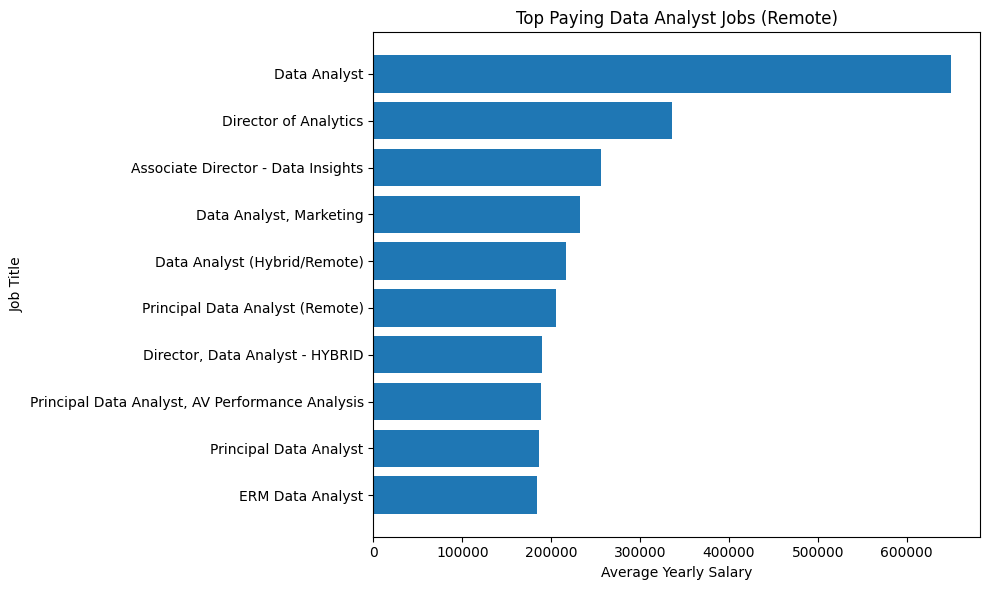
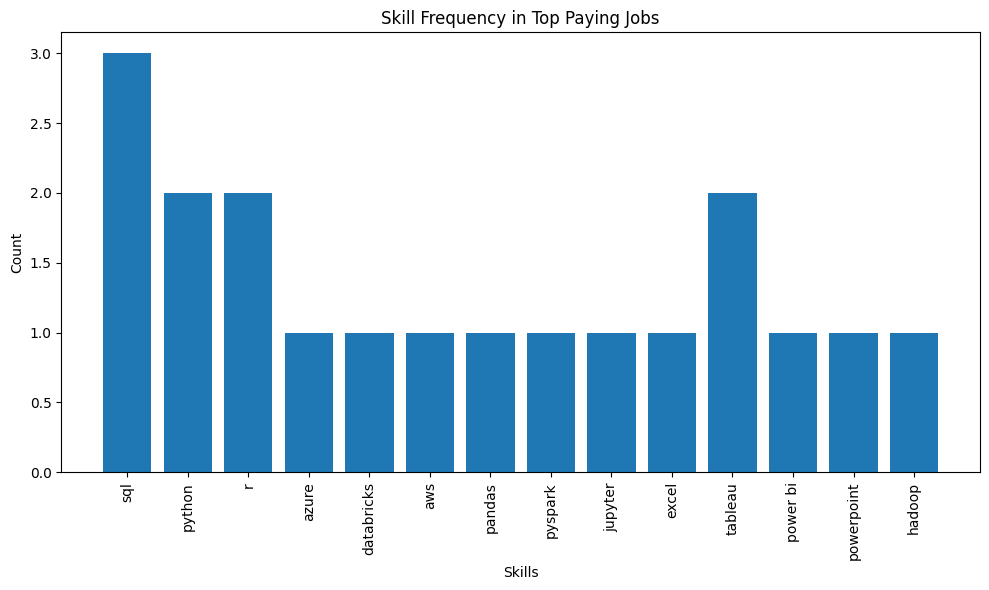

# Introduction
📊 Dive into the data job market! focusing on data analyst roles, this project explores 💰top-paying jobs,🔥in-demand skills, and 📈 wherehigh demands meets high salary in data analytics.

🔍 SQL queries? Check them out here: [project_sql folder](/project_sql/)

# Background
Driven by a quest to navigate the data analyst job market more effectively, this project was born from a desire to pinpoint top-paid and in-demand skills, streamlining others works to find optimal jobs.

Data is packed with insights on job titles, salaries, locations and essential skills.

### The questions I wanted to answer through my SQL queries were:

1. What are the top paying data analyst jobs?
2. What skills are required for these top paying jobs?
3. What skills are most in demand for data analysts?
4. Which skills are associated with higher salaries?
5. What are the most optimal skills to learn?

# Tools I used
For my deep dive into the data analyst job market, I harnessed the power of several key tools:

- SQL: The backbone of my analysis, allowing me to query the database and unearth critical insights.
- PostgreSQL: The chosen database management system, ideal for handling the job posting data.
- Visual Studio Code: My go-to for database management and executing SQL queries.
- Git and GitHub: Essential for version control and sharing my SQL scripts and analysis, ensuring collaboration and project tracking. 

# The Analysis
Each query for this project aimed at investigating specific aspects of the data analyst job market. Here's how I approached each question:


### 1. Top Paying Data Analyst Jobs
To identify the highest-paying roles, I filtered data analyst positions by average yearly salary and location, focusing on remote jobs. This query highlights the high paying oppurtunities in the field.

```sql
SELECT
    j.job_id,
    j.job_title,
    j.job_location,
    c.name,
    j.job_schedule_type,
    j.salary_year_avg,
    j.job_posted_date
FROM
    job_postings_fact AS j
LEFT JOIN
    company_dim AS c
    ON j.company_id = c.company_id
WHERE
    j.job_location = 'Anywhere' AND
    j.job_title_short IN ('Data Analyst') AND
    j.salary_year_avg IS NOT NULL
ORDER BY
    j.salary_year_avg DESC
LIMIT 10
```
Here's the breakdown of the top data analyst jobs in 2023:
- **Wide Salary Range:** Top 10 paying data analyst roles span from $184,000 to $650,000, indicating significant salary potential in the field.
- **Diverse Employers:** Companies like SmartAsset, Meta and AT&T are among those offering high salaries, showing a broad interest accross different industries.
- **Job Title Variety:** There is a high diversity inn job titles, from Data Analyst to Director of Analytics, reflecting varied roles and specializations within data analytics.


*Bar Graph visualizing the salary for the top 10 salaries for data analysts; ChatGPT generated this graph from my SQL query results*

### 2. Skills for Top Paying Jobs
To understand what skills are required for the yop-paying jobs, I joined the job posyings with the skills data, providing insights into what employers value for high-compensation roles.
```sql
WITH top_pay_job AS (
    SELECT
        j.job_id,
        j.job_title,
        j.job_location,
        c.name,
        j.job_schedule_type,
        j.salary_year_avg,
        j.job_posted_date
    FROM
        job_postings_fact AS j
    LEFT JOIN
        company_dim AS c
        ON j.company_id = c.company_id
    WHERE
        j.job_location = 'Anywhere' AND
        j.job_title_short IN ('Data Analyst') AND
        j.salary_year_avg IS NOT NULL
    ORDER BY
        j.salary_year_avg DESC
    LIMIT 10
)

SELECT
    top_pay_job.job_id,
    top_pay_job.job_title,
    top_pay_job.name,
    top_pay_job.salary_year_avg,
    js.skills
FROM
    top_pay_job
INNER JOIN
    skills_job_dim AS skill_job
    ON top_pay_job.job_id = skill_job.job_id
INNER JOIN
    skills_dim AS js
    ON skill_job.skill_id = js.skill_id
WHERE
    js.skills IS NOT NULL
ORDER BY
    top_pay_job.salary_year_avg DESC
```
here's the breakdown of the demanded skills for the top 10 highest paying data analyst job in 2023:
- **SQL** is leading with a bold count of 8.
- **Python** follows closely with a bold count of 7.
- **Tableau** is also highly sought after, with a bold count of 6.
Other skills like **R**, **Snowflake**, **Pandas** and **Excel** shows varying degrees of demands.


*Bar graph visualizing the count of skills for the top 10 paying jobs for data analysts; ChatGPT generated this graph from my SQL query results*

### 3. In-Demand Skills for Data Analyst

this query helped identify the skills most frequently requested in jobv postings, directing focus to areas with high demand

```sql
SELECT
    skills,
    COUNT(skills_job_dim.job_id) AS count
FROM
    job_postings_fact
INNER JOIN
    skills_job_dim
    ON job_postings_fact.job_id = skills_job_dim.job_id
INNER JOIN
    skills_dim
    ON skills_job_dim.skill_id = skills_dim.skill_id
WHERE
    job_postings_fact.job_work_from_home = 'TRUE' AND
    job_postings_fact.job_title_short = 'Data Analyst'
GROUP BY
    skills
ORDER BY
    count DESC
LIMIT
    5;    
```
Here's the breakdown of the most demanded skills for data analysts in 2023
- **SQL** and **Excel** remain fundamental, emphasizing the need for strongfoundationnal skills in data processing and spreadsheet manipulation.
- **Programming** and **Visualization Tools** like essential, pointing towards the increasing importance of technical skills in data storytelling and decision support   

| Skills   | Demand Count |
|----------|--------------|
| SQL      | 7291         |
| Excel    | 4611         |
| Python   | 4330         |
| Tableau  | 3745         |
| Power BI | 2609         |

*Table of the demand for the top 5 skills in data analyst job postings*

### 4. Skills Based on Salary
Exploring the average salaries associated with different skills revealed which skills are the highest paying.
```sql
SELECT
    ROUND(AVG(j.salary_year_avg), 2) AS average_salary,
    COUNT(j.job_id) AS job_count,
    s.skills
FROM
    job_postings_fact AS j
INNER JOIN
    skills_job_dim AS sj
    ON j.job_id = sj.job_id
INNER JOIN
    skills_dim AS s 
    ON sj.skill_id = s.skill_id
WHERE
    j.job_title_short = 'Data Analyst' AND
    j.salary_year_avg IS NOT NULL
GROUP BY
    s.skills
ORDER BY
    average_salary DESC
LIMIT 10;
```
Here's the breakdown of the results for top paying skills for Data Analysts:
- **High Demand for Big Data & ML Skills:** Top salaries are commanded by analysts skilled in big data technologies (PySpark, Couchbase), machine learning tools (DataRobot, Jupyter), and Python libraries (Pandas, Numpy), reflecting the industry's high valuation of data processing and predictive modeling capabilities.
- **Software Development & Deployment Proficiency:** Knowledge in development and deployment tool (GitLab, Kubernetes, Airflow) indicates a lucrative crossover between data analysis and engineering, with a premium on skills that facilitate automation and efficient data pipeline management.
- **Cloud Computing Expertise:** Familiarity with cloud and data engineering tools(Elasticsearch, Databricks, GCP)  underscore the growing importance of cloud-based analytics environment, suggesting that cloud proficiencysignificantly boosts earning potential in data analytics. 

| Skills        | Average Salary ($) |
|---------------|--------------------|
| pyspark       | 208,172            |
| bitbucket     | 189,155            |
| couchbase     | 160,515            |
| watson        | 160,515            |
| datarobot     | 155,486            |
| gitlab        | 154,500            |
| swift         | 153,750            |
| jupyter       | 152,777            |
| pandas        | 151,821            |
| elasticsearch | 145,500            |

*Table of the average salary for the top 10 paying skills for data analysts*

### 5. Most Optimal Skills to Learn
Combining insights from demand and salary data, this query aimed to pinpoint skilld that are both in high demand and have high salaries, offering a strategic focus for skill development 
```sql
SELECT
    s.skills,
    COUNT(DISTINCT j.job_id) AS job_count,
    ROUND(AVG(j.salary_year_avg), 2) AS average_salary
FROM
    job_postings_fact AS j
INNER JOIN
    skills_job_dim AS sj
        ON j.job_id = sj.job_id
INNER JOIN
    skills_dim AS s 
        ON sj.skill_id = s.skill_id
WHERE
    j.job_title_short = 'Data Analyst'
    AND j.salary_year_avg IS NOT NULL
GROUP BY
    s.skills
HAVING
    COUNT(DISTINCT j.job_id) >= 10
ORDER BY
    average_salary DESC,
    job_count DESC
LIMIT 10;
```
| Skill ID | Skills     | Demand Count | Average Salary |
|----------|------------|--------------|----------------|
| 8        | go         | 27           | 115,320        |
| 234      | confluence | 11           | 114,210        |
| 97       | hadoop     | 22           | 113,193        |
| 80       | snowflake  | 37           | 112,948        |
| 74       | azure      | 34           | 111,225        |
| 77       | bigquery   | 13           | 109,654        |
| 76       | aws        | 32           | 108,317        |
| 4        | java       | 17           | 106,906        |
| 194      | ssis       | 12           | 106,683        |
| 233      | jira       | 20           | 104,918        |

*Table of the most optical skills for data analyst sorted by salary*

Here's a breakdown of the most optimal skills for Data Analysts in 2023:
- **High-Demand Programming Languages:** Python and R stand out for their high demands, with demand counts of 236 and 148 respectively. Despite their high demand, their average salaries are around $101,397 for Python and $100,499 for R, indicating that proficiency in these language is highly valued but also widely available.
- **Cloud Tools & Technologies:** Skills in specialized technologies such as Snowflake, Azure, AWS and BigQuery show significant demand with realatively high average salaries, pointing towards the growing importance of cloud platforms and big data technologies in data analysis.
- **Business Intelligence & Visualization Tools:** Tableau and Looker, with demand counts of 230 & 49 respectively, and average salaries around $99,288 and $103,795, highlight the critical role of data visualization and business intelligence in deriving actionable insights from data.
- **Database Technologies:** The demand for skills in traditional and NoSQL databases (Oracle, SQL Server, NoSQL) with average salaries ranging from $97,786 to $104,534, reflects the enduring need for data storage, retrieval and management expertise.

# What I learned

Throughout this adventure, I've turbocharged my SQL toolkit with some serious firepower:

- **🧩 Complex Query Crafting:** Mastered the art of advanced SQL, merging tables like a pro and wielding WITH clauses for ninja level temp table maneuvers. 
- **📊 Data Aggregation:** Got cozy with GROUP BY and turned aggregate functions like COUNT() & AVG() into my data-summarizing sidekicks. 
- **💡 Analytical Wizardry:** Leveled up my real-world puzzle-solving skills, turning questions into actionable, insightful SQL queries.

# Conclusions

### Insights
From the analysis, several general insights emerged:

**1. Top-Paying Data Analyst Jobs:** The highest-paying jobs for data analysts that allow remote work offer a wide range of salaries, the highest at $650,000!

**2. Skills for Top-Paying Jobs:** High paying data analyst jobs requires advanced proficiency in SQL, suggesting its critical skill for earning a top salary.

**3. Most In-Demand Skills:** SQL is also the most demanded skill in the data analyst job market, thus making it essential for job seekers.

**4. Skills with Higher Salaries:** Specialized skills, such as SVN and Solidity, are associated with the highest average salaries, indicating a premium on niche expertise.

**5. Optimal Skills for Job Market Value:** SQL leads in demand and offers for a high average salary, positioning it as one of the most optimal skills for data analysts to learn to maximize their market value.

### Closing Thoughts

This project enhanced my SQL skills and providede valuable insights into the data analyst job market. The findings from the analysis serve as a guide to prioritizing skill development and job search efforts. Aspiring data analysts can better position themselves in a competitive job market by focusing on high-demand, high-salary skills. This exploration highlights the importance of continous learning and adaptation to emerging trends in the field of data analytics.